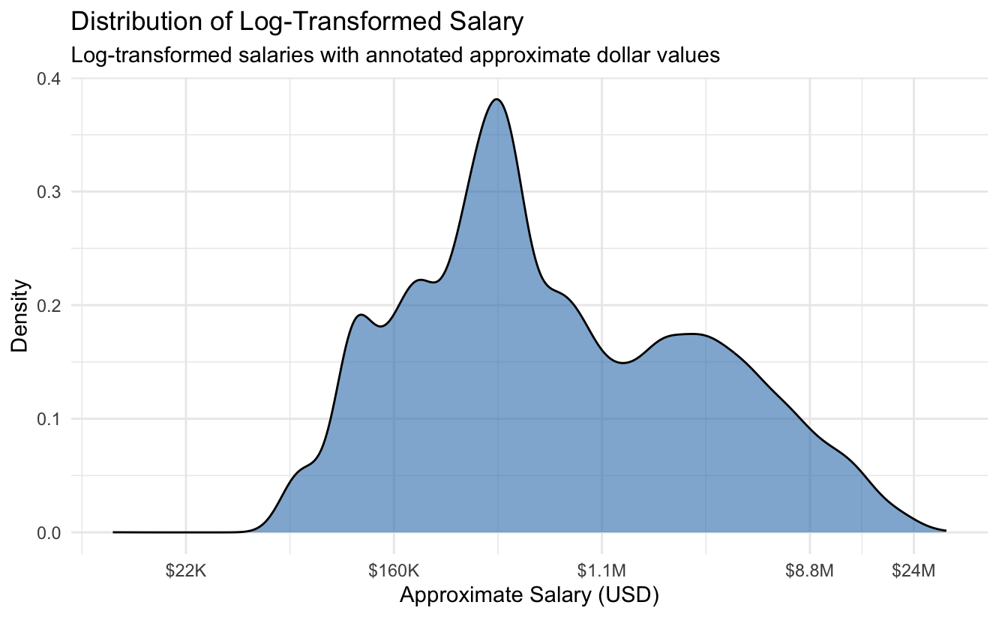
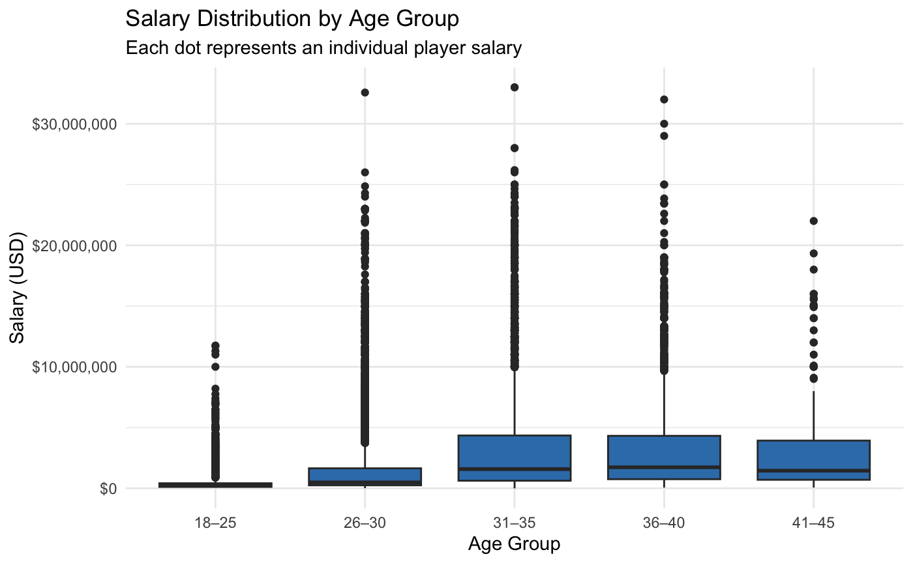
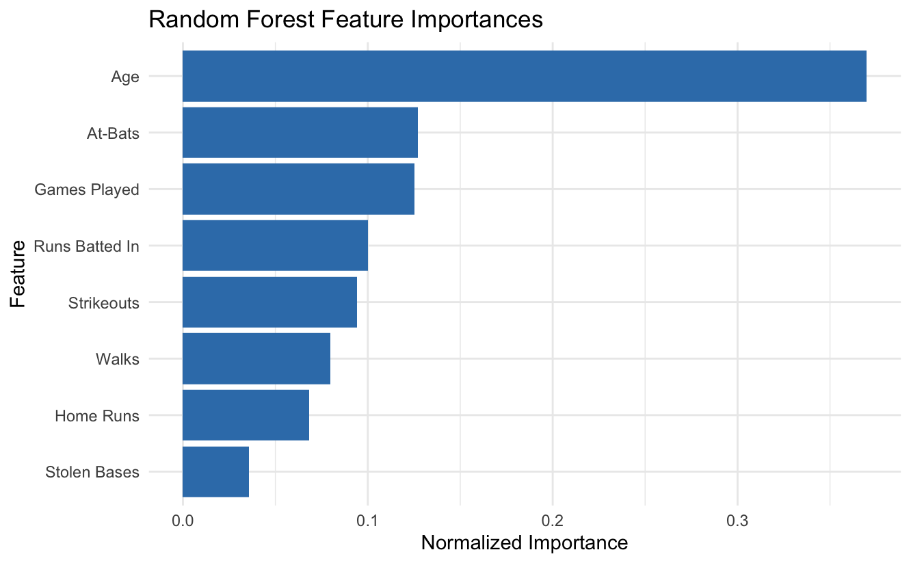

## Executive Summary

This project explores how Major League Baseball (MLB) player performance metrics can be used to predict salaries using machine learning. Using a Random Forest model trained on historical MLB data from 1985 to 2015, the model estimates how key statistics like home runs, walks, strikeouts, and stolen bases relate to compensation. To make these insights accessible and actionable, the project also includes an interactive Shiny app that allows users to input player stats and receive a predicted salary.

## Introduction

With the rise of performance analytics in professional sports, front offices increasingly use data to inform contract negotiations and roster decisions. Player salaries are influenced by a mix of on-field statistics, reputation, timing, and negotiation. This project asks: Can performance metrics be used to predict MLB salaries? While salary is not a perfect proxy for a player’s value as it is influenced by different factors such as service time, contract status, and team budget, it remains a useful signal of how teams compensate players based on performance. Therefore, salary serves here as a proxy for how front offices financially value performance, with the understanding that it reflects more than just on-field production.

This article presents a predictive model, accessible visuals, and an interactive app that simplifies this complex topic. The intended audience includes sports analysts, data professionals, and baseball fans with an interest in statistics. The article assumes familiarity with baseball concepts like home runs and RBIs.

## Data and Methods

### Data Sources

This project uses data from the [Lahman Baseball Database](https://www.kaggle.com/datasets/seanlahman/the-history-of-baseball), which compiles comprehensive historical statistics for Major League Baseball players. The version used includes data from 1985 to 2015, including batting statistics, salaries, and player demographics.

- `player.csv`: Player IDs and names

- `batting.csv`: Yearly performance metrics

- `salary.csv`: Player salaries (available from 1985 onward)

Only relevant data were retained; performance and demographic variables, and age was calculated by subtracting birth year from the season year.

Some players in the dataset had missing batting stats, often because they didn’t step up to bat that season (like pitchers or bench players). In these cases, I filled in missing values with 0, since it likely meant they just didn’t play offensively that year.

To make salary predictions more accurate, I adjusted the salary numbers by applying a log transformation. Why? Because a few superstar players earn tens of millions while most others earn far less, which can throw off a model. Log transformation compresses those extremes so patterns in the data are easier to spot and predict.

I chose a Random Forest model for this project. Random Forest is a machine learning method that combines the results of many smaller decision trees to make better predictions. Think of it like asking 100 scouts for their opinions and taking the average, it helps avoid bad guesses from any one tree. This approach is great for spotting complex relationships in the data while still giving us insight into which stats matter most.

To make sure the model would perform well on new data, I split the dataset into two parts: one to train the model and one to test how well it works. This helped ensure the predictions weren’t just accurate for past data, but also generalizable for new, unseen cases.

One limitation to note is that salaries are reported in nominal dollars, so they are not adjusted for inflation. As a result, a \$1 million salary in 1985 is treated the same as one in 2015, even though their real-world value differs. While this could introduce temporal bias, the goal here is not to compare players across decades directly but to model salary patterns within the era's context. Future iterations could improve on this by converting all salaries to constant dollars.

**How to Use the App**

To use the Shiny app, slide to enter a player’s age and stats like home runs, RBIs, and strikeouts. The model will return a predicted salary based on those inputs. This tool allows users to explore how changes in performance metrics influence expected earnings.

The app displays both a single point estimate and a prediction range, based on variability across the model’s predictions. This helps communicate that the estimate is one plausible outcome within a broader range of possible salaries.

[👉 Try the MLB Salary PredictorShiny App](https://eoda.shinyapps.io/DACSS604_final_app/)

## Exploratory Findings

To better understand the patterns behind MLB salaries, I created a few simple visualizations. These help show how salaries are spread out, how they vary by player age, and which performance stats seem to matter most in predicting earnings.

- Histograms of Log-Transformed Salary Distribution

  

  This smoothed density plot shows how player salaries are distributed after applying a log transformation and converting the values back to approximate dollar amounts. The transformation compresses extreme high-end salaries, caused by a small number of very highly paid players, and reveals underlying patterns in the majority of salaries. Without this transformation, the raw salary distribution would be heavily right-skewed, making it difficult to observe variation among lower- and mid-range earners.

  After transformation, the highest density of salaries falls between approximately \$160K and \$1.1 million, indicating this is the most common salary range. A smaller number of players earn near the league minimum (between \$22K and \$160K), while the right tail shows that some players earn between \$8.8 million and \$24 million. Salaries that were originally missing and imputed as \$0 were excluded from this plot to avoid distortion in the lower range.

- Boxplot of Salary by Age Group

  

  This boxplot compares salaries across different age groups. Each dot represents a single player’s salary, helping show just how much earnings can vary even among players of the same age bracket. Salaries generally increase with age, peaking in the early 30s, then gradually decline, reflecting the typical career arc of MLB players.

- Feature Importance using Random Forest

  

  To find out which stats were most useful for predicting salary, the Random Forest model ranked the features it used.

  The model found that age, at-bats, and games played were the most important predictors of salary. This suggests that teams may value consistency and experience; showing up, staying healthy, and contributing regularly, more than flashy one-off stats like home runs.

## Case Studies

These examples will illustrate limitations of statistical models, such as the influence of factors not captured in the data to show how non-performance-related factors also affect salaries, as there are always anomalies in the real world.

### Case Study 1: Same Stats, Different Outcomes

Two players: Miguel Cabrera and Jacoby Ellsbury, had comparable offensive stats at age 28, including nearly identical RBI totals and similar home run counts. However, the model predicted very different salaries for them:

|                  | Miguel Cabrera | Jacoby Ellsbury |
|------------------|----------------|-----------------|
| Age              | 28             | 28              |
| HR               | 30             | 32              |
| RBI              | 105            | 105             |
| BB               | 108            | 52              |
| SO               | 89             | 98              |
| Actual Salary    | \$20,000,000   | \$2,400,000     |
| Predicted Salary | \$10,908,132   | \$2,263,148     |

Despite similar stats, the model predicted a much higher salary for Cabrera, likely due to differences in walks, strikeouts, and possibly overall playing consistency. While the model aligned fairly well with Ellsbury’s actual salary, it still underestimated Cabrera’s actual earnings by nearly \$9 million.

This case highlights the influence of non-performance factors that are not captured in the dataset, such as previous MVP awards, career accolades, marketability, and contract history. Cabrera had already signed high-value extensions, whereas Ellsbury was still under team control. These gaps demonstrate that while the model accounts for observable performance, real-world salary outcomes are also shaped by factors beyond the model's scope, such as contract stage, arbitration eligibility, and prior negotiations.

### Case Study 2: Mike Trout: Back-to-Back Elite Seasons, Drastically Different Salaries

In both 2014 and 2015, Mike Trout delivered superstar-level performance. Yet while the model predicted relatively modest salary increases based on performance metrics alone, Trout’s actual salary increased by over \$5 million.

| Year | Age | G   | HR  | RBI | BB  | SO  | Actual Salary | Predicted Salary |
|------|-----|-----|-----|-----|-----|-----|---------------|------------------|
| 2014 | 23  | 157 | 36  | 111 | 83  | 184 | \$1,000,000   | \$912,538        |
| 2015 | 24  | 159 | 41  | 90  | 92  | 158 | \$6,083,000   | \$1,731,904      |

In 2014, Trout was under pre-arbitration team control, earning near the league minimum. The model's estimate (\~\$912K) aligned closely with reality. In 2015, Trout signed a preemptive long-term extension, raising his salary to over \$6 million, which is far beyond the model’s estimate (\~\$1.73M). Performance-based models can reflect patterns in salary history, but they miss contract structures, negotiation timing, and organizational strategy.

This case highlights that even high-performing models can mislead if we overlook the invisible variables, like MLB’s labor rules and team decision-making.

## Limitations

- Non-performance factors (e.g., injuries, media, agent negotiations) are excluded.

- Defensive performance and player position are not included in the model.

- Data is limited to 1985–2015, and trends may have shifted since.

- Salary data availability may be biased toward players who signed public contracts.

## Uncertainty and Temporality

This model generates a point estimate of salary, but it is important to understand that real-world compensation varies widely. To reflect this uncertainty, the Shiny app includes a predicted salary range, based on ±1 standard deviation around the model’s log-transformed predictions. This helps communicate that the estimate is just one plausible outcome among many.

Temporality is another important factor. The dataset only covers 1985 to 2015, and much has changed in MLB since then. Teams now rely more on advanced metrics like WAR and exit velocity. Younger players are increasingly valued, and new collective bargaining agreements have reshaped how arbitration and free agency work. In addition, inflation adjustments are not taken into account, so inflation-adjusted salaries could enhance accuracy and relevance for modern applications. This model reflects the logic of a previous era, and its predictions should be interpreted accordingly.

## Conclusion

This analysis shows that performance metrics like at-bats, games played, and RBIs are significant predictors of player salary, but they do not tell the whole story. The feature importance bar chart shows that age was the most influential feature overall, likely reflecting how experience and contract stage influence negotiations. Surprisingly, high-profile stats like home runs or stolen bases played a lesser role than expected.

Visualizations also highlighted how salary distributions shift with age and how real-world salaries sometimes deviate sharply from what performance would predict. These outliers, explained by factors like arbitration status, media visibility, or contract timing, shows that compensation is as much about context as performance.

Overall, this project underscores the power and limits of using machine learning in sports analytics. Data can reveal hidden patterns and support fairer decision-making, but it’s not a substitute for judgment or institutional knowledge. The Shiny app and accompanying visuals are meant to invite exploration, spark conversation, and make complex analytics accessible to a wider audience.
